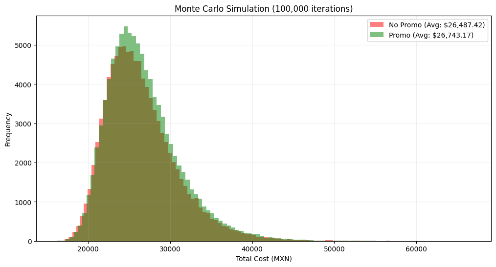
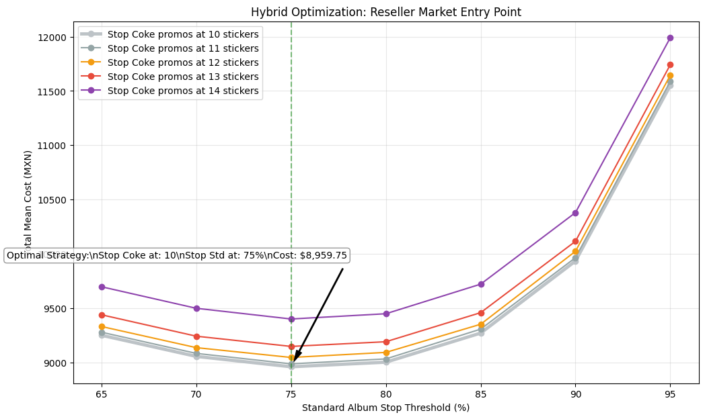
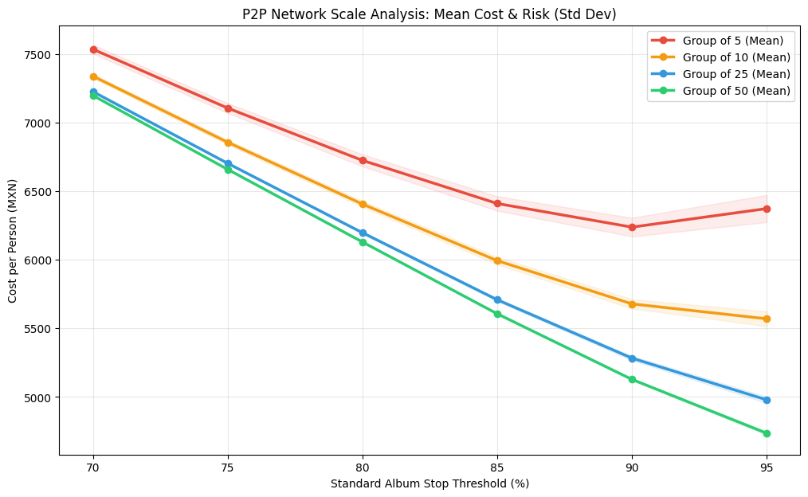
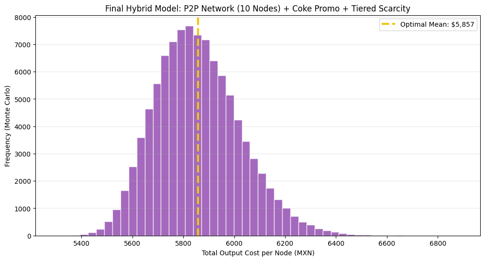

# Stochastic Optimization for Asset Acquisition: The World Cup Album Case

## Introduction
Every four years, the release of the World Cup sticker album presents a classic mathematical challenge: **The Coupon Collector's Problem**. As the number of unique assets increases and market prices fluctuate, completing the collection individually becomes financially inefficient due to high collision probabilities (duplicates).

This project explores the mathematical viability, speed, and cost-efficiency of different acquisition strategies, moving from purely stochastic methods to distributed Peer-to-Peer (P2P) networks, while integrating real-world market scarcity and hybrid promotional assets.

## Methodology & Evolution
To find the most viable path to completion, the research was divided into several simulation phases using **Monte Carlo** methods:

1. **Baseline Analysis (The Inefficiency of Isolated Nodes):** We simulated the standard acquisition path for a single user, proving that relying purely on stochastic acquisition without stop-loss thresholds is fundamentally unscalable, resulting in extreme financial variance and costs exceeding $26,000 MXN.

2. **Hybrid Market Optimization (Grid Search):** We introduced the Coca-Cola promotional packs (hybrid assets yielding both special and standard stickers). Through a two-dimensional grid search, we found the absolute "Sweet Spot" for stopping stochastic purchases: **10 Coke stickers** and **75% standard album completion** for an individual.

3. **P2P Network Scalability (Variance Collapse):** We simulated distributed networks from 5 to 50 nodes. Implementing a zero-marginal-cost exchange protocol for duplicates absorbs probabilistic friction. A 10-node network proved to be the optimal logistical balance, allowing the group to push the random-pack threshold up to **95%** efficiently.

4. **Real-World Scarcity Model (Master Simulation):** The final model combines the 10-node P2P network, the Coke promo stop-loss, and dynamic market tiering. By categorizing missing assets into Tiers based on real scarcity (Legends/Rookies at $300 MXN, Standard at $25 MXN, Commons at $10 MXN), we created a production-ready simulation.

## Key Findings: The Power of 10 & Stop-Loss Strategy
The research concludes that the most efficient strategy is the **10-Node Collaborative Network with Strict Stop-Loss Rules**. 





* **Cost Efficiency:** A member of a 10-person P2P network reaches completion with an average cost of **~$5,857 MXN**, even when accounting for highly expensive Tier 1 assets in the secondary market. This is a massive reduction from the solo approach.
* **Risk Mitigation (Variance Collapse):** Collaboration acts as a natural buffer against "bad luck". The standard deviation of the final cost in the 10-node network drops to a mere **±$167 MXN**, making the budget highly predictable.
* **Optimal Pivot Rules:** 1. Stop buying Coke promos exactly at **10 special stickers**.
  2. Stop buying standard packs exactly at **95% group completion**.
  3. Liquidate the remaining missing assets directly through tiered resellers.





## How to Run
This project is contained within a Jupyter Notebook. To replicate the massive parallel simulations and generate the charts:

### Prerequisites
- Python 3.8+
- Git

### Setup
```bash
# Clone the repository
git clone https://github.com/tadeofloo/strategies-to-complete-the-2026-world-cup-album.git
cd strategies-to-complete-the-2026-world-cup-album

# Create and activate virtual environment (Linux/macOS)
python3 -m venv venv
source venv/bin/activate

# Create and activate virtual environment (Windows)
python -m venv venv
.\venv\Scripts\activate

# Install dependencies
pip install -r requirements.txt
```

### Execution
Launch the Jupyter Notebook:
```bash
jupyter notebook
```
Open `album.ipynb` and select **Cell > Run All**. Note: Due to the high iteration count (up to 100,000), multiprocessing will utilize all available CPU cores.

## Tech Stack
* **Language:** Python
* **Parallelism:** Multiprocessing (CPU core distribution for massive simulations)
* **Libraries:** NumPy (Data handling), Matplotlib (Visualization)